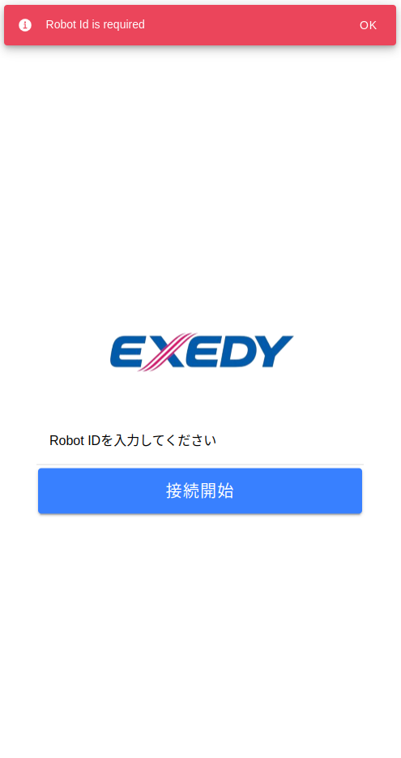

<h5 align="center">
  <br>
  <b>Ionic + Vue</b>
</h5>
<p align="center">
  
</p>

## :eyes: Overview
<div>
  
  
  
</div>
<br/>

> Take a look in https://dashboard.ionicframework.com/preview/e201cccd/1mto17zs2a for demo application.

## :open_book: About
This project is a simple Ionic app template, using VueJS framework and Capacitor. It brings a simple folder structure and some components.

## :bricks: This project was built with:
- [Ionic](https://ionicframework.com/)
- [Ionic + Vue](https://ionicframework.com/vue)
- [Vue](https://vuejs.org/)
- [Tailwind CSS](https://tailwindcss.com/)

## :running_man: Installing and Running
1. Clone this repository `https://github.com/khulqu15/exedy.app.git`
2. Enter the project's folder: `cd exedy.app`
3. Run `npm install`
4. Run `npm run serve`
5. Access `http://localhost:8080` in your browser and be happy 😃

## :recycle: Contribute
1. Fork this repository
2. Create a branch with your feature: ```git checkout -b my-feature```
3. Commit your changes: ```git commit -m 'feat: My new feature'```
4. Push your branch: ```git push origin my-feature```

## :page_with_curl:	License
This project is under the MIT license. Take a look at the [LICENSE](LICENSE) file for more details.

## 📚 Learn more

* Ionic Vue Docs: https://ionicframework.com/docs/vue/overview